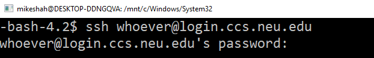

## Part 0 - Obtain the repo from Github Classroom

1. Make sure you have accepted the invitation to the classrepo from the main course page (you wouldn't be here if you hadn't :-).
2. Run through the following github tutorial if you are not familiar with git.
  - https://guides.github.com/introduction/git-handbook/
  - This is worth the 15 minutes it takes to avoid headaches later on!
  - Video guides if needed: [https://www.youtube.com/githubguides](https://www.youtube.com/githubguides)
  
## Part 0.5 - Making a local directory for this class and your repositories

Make a directory called `cs3650`. Change to that directory. 

## Part 1 - The Network is down! How to work locally.

If the Internet is not available, how can you make progress on your projects?  The solution is to install a local (i.e. on your desk/labtop machine) virtual machine. A virtual machine emulates an entire operating system!

I have released  a "Vagrantfile" that you can use to set up a virtual machine similar to the environment running on bottlenose (same release of Debian, same installed programs) at https://course.ccs.neu.edu/cs3650f20/Vagrantfile.  Download this to your `cs3650` directory.

### Download and install VirtualBox
Go to the [VirtualBox Downloads](https://www.virtualbox.org/wiki/Downloads) page and get the appropriate installer for your platform. Install the package using standard procedures for your operations system. Once VirtualBox is installed, continue to the next section to download and install Vagrant on your system. 

### Download and install Vagrant
Go to the [Vagrant downloads](https://www.vagrantup.com/downloads.html) page and get the appropriate installer or package for your platform. Install the package using standard procedures for your operating system.

The installer will automatically add the `vagrant` command  to your system path so that it is available in terminals. If it is not found, please try logging out and logging back in to your system (this is particularly necessary sometimes for Windows).

In the `cs3650` directory where you downloaded `Vagrantfile`, perform the following commands:
```
$ vagrant up                 # This downloads, installs, and configures your virtual machine.  
                             # This can take a LONG time.  Do not stop it or turn it off or you will have to start over.
$ vagrant ssh-config         # This will show vagrant Image IP Address, port details 
$ vagrant ssh                # This will connect you to your vagrant image at the command line
```
Now you have a virtual machine running Debian 10.  The contents of your `cs3650` directory are available in the VM at `/vagrant`.  Anything you put in your `cs3650` directory on your regular or host system, is available in the VM at `\vagrant`.  
Take a screenshot of the window running the VM. Name it **linux.[jpg|png|pdf|pbm]**, i.e. whatever the binary format that your screenshot software on your computer generates.

If you exit the VM, the virtual machine is still running.  To reconnect to it, enter `vagrant ssh`.

To shut down the VM, enter `vagrant halt`.  To remove the VM, enter `vagrant destroy`, which stops and deletes all traces of the vagrant machine.  

To restart the VM after either of the two commands, enter `vagrant up`.

[Vagrant Documentation](https://www.vagrantup.com/docs) has more information on using your vagrant VM. 

## Part 1.5 - Obtaining your repo (i.e. cloning your repository)

When you have successfully ssh'd into your repository (Part 1) you should download a copy of your repository. The rough workflow for using git is the following.

1. Run `git clone your_repository_url` to establish a git repository on your system. *your_repository_url* is found by clicking the 'green' button on you Monorepo homepage(move one directory up from this folder).

	i. It should look something like `https://github.com/CourseName/Monorepo-yourname.git`
	
2. When you make a change to a file within this directory you can see what is different by:

	i. run `git status` to see what you have changed locally on your computer. Changes you have made locally have not yet been saved to github's servers. 

3. When you are happy with your changes do `git add whatever_file.c` which prepares that specific file to be added to the master. [[git add documentation](https://git-scm.com/docs/git-add)]

4. Next, you will do `git commit -m "some informative message about your changes"` to record changes in your repository [[git-commit documentation](https://git-scm.com/docs/git-commit)]

5. Finally, do a `git push` to actually make things happen--meaning everything you have added will go to the github server. You can check your github.com repository to see exactly what I will see. [[git push documentation](https://git-scm.com/docs/git-push)]

A cheatsheet has been added to the repository (Under /ExternalResources) that may be helpful!

### Wait, can I clone my github repository to multiple places?

Yes, the idea here is you can ``git clone`` your repository in multiple locations(e.g. once on the khoury servers, and again locally on your Virtual Machine). You can work in each repository, and then push your changes online in whatever environment you are in. Then if the khoury servers which you are ssh'ing into are down for any reason, you can do a ``git pull`` in a local linux environment, still make forward progress, then push your changes (Then next time you ssh to the khoury servers, you would do a git pull, and then make updates).


## Part 2 - SSH

In this class, it is best to work on the Debian 10 Virtual Machine  you will build below, but the khoury servers, while not running Debian 10, are a good place to practice your Unix skills and do some code development. In order to do so, we have to connect to them online.

**Remember**: I don't care what operating system you use locally as long as you have a terminal and internet access, and have a VM.

### ssh clients for each operating system

* For Windows Users installing Putty is sufficient. [https://www.putty.org/](https://www.putty.org/)
  * The best option is to install the bash shell from the Windows Store. [https://docs.microsoft.com/en-us/windows/wsl/install-win10](https://docs.microsoft.com/en-us/windows/wsl/install-win10)
* For Linux/Mac users, you already have a terminal available! Just search for the 'terminal' application.
* Your virtual machine is in a terminal from which you can ssh from too.

### ssh'ing
* Once your terminal is open, 'ssh' into Khoury with: `ssh khoury_user_name_here@login.khoury.neu.edu`
  * If for some reason you do not have a Khoury username, [follow these instructions](https://www.khoury.northeastern.edu/systems/getting-started/)
* After you have successfully ssh'd, you are now running programs on the Khoury servers (i.e. not locally on your machine).

<center></center>


## Part 3 - The (at least) 10 Commands

Try running the following commands (See deliverables section at the end for copying and pasting to [output.txt](./output.txt)).

1. [ls](http://man7.org/linux/man-pages/man1/ls.1.html) - lists the files and folders in the current directory.
2. [pwd](https://linux.die.net/man/1/pwd) - Echos (i.e. prints) the current directory you are in to the terminal
3. [mkdir](http://man7.org/linux/man-pages/man2/mkdir.2.html) - Create a new directory
4. [rmdir](http://man7.org/linux/man-pages/man2/rmdir.2.html) - Removes an empty directory
5. [cd](http://man7.org/linux/man-pages/man1/cd.1p.html) - Change directory
6. [mv](https://linux.die.net/man/1/mv) - Allows you to move a file elsewhere (sometimes I use this to rename a file)
7. [cp](http://man7.org/linux/man-pages/man1/cp.1.html) - Copies a file
8. [touch](https://linux.die.net/man/1/touch) - Typically I use to create a new empty file that does not exist.
9. [man](http://man7.org/linux/man-pages/man1/man.1.html) - Manual pages
10. [ps](http://man7.org/linux/man-pages/man1/ps.1.html) - Shows which processes are running
11. [echo](https://linux.die.net/man/1/echo) - Prints out a line of text.
12. [whoami](https://linux.die.net/man/1/whoami) - Prints which user you are logged in as.
13. [sort](http://man7.org/linux/man-pages/man1/sort.1.html) - Sorts information
14. [cat](http://man7.org/linux/man-pages/man1/cat.1.html) - Concatenates files and prints them to standard output
15. [nl](http://man7.org/linux/man-pages/man1/nl.1.html) - Outputs a file with number of lines
16. [cut](http://man7.org/linux/man-pages/man1/cut.1.html) - Remove sections from each file
17. [grep](http://man7.org/linux/man-pages/man1/grep.1.html) - Prints lines that match a pattern. This is a very powerful serach command.
18. Other interesting commands/programs include:  [sed](https://linux.die.net/man/1/sed), [awk](https://linux.die.net/man/1/awk), [locate](https://linux.die.net/man/1/locate), [clear](https://linux.die.net/man/1/clear)

*Note from instructor:* I included urls to the commands above, but it will almost always be faster for you to search the man pages within your terminal (and if you do not have terminal access, you will want to use the manual pages anyway).

### Navigating the terminal quickly (Read and try each)

Here are some other nice things to know with the terminal.

* Pressing up and down arrowkeys iterates through your command history (There is also a commmand called *history* you can checkout).
* Pressing *tab* autocompletes if it finds a program, command, or file path.
	* Start typing `mkdi` then hit `tab`
	* `tab` can also auto-complete filenames and filepaths, this can be especially helpful!
* Pressing Ctrl+C sends a signal to the terminal to terminate a program if it gets stuck.
	* Type: `grep .` Then press `Ctrl+C` to terminate.
* Pressing Ctrl+Z sends a signal to the terminal to suspend a program and give you back control.
  * You can play with this command by typing in *sleep 10* (which puts the terminal to sleep) for 10 seconds, and see how you can terminate this program.
* Practice getting help by typing `man ssh` into the terminal. (Press q to quit the manual pages).

### A bit of precision
Calling each of these 'commands' (i.e. ls, sort, cat, etc.) is not really correct. Each of these is itself a program (typically implemented in C or some other language).

As an example, here is the source code for 'ls': http://git.savannah.gnu.org/cgit/coreutils.git/tree/src/ls.c
Each of these commands are part of the coreutils package in Unix. If you look through the source tree, you will additionally find many other programs (i.e. terminal commands you run in your shell) here: http://git.savannah.gnu.org/cgit/coreutils.git/tree/src/.

## Part 4 - Learn-C 

The main programming language we will be using in this course is "C".

Complete the 'Learn the Basics' section of the C tutorial on the web from [http://www.learn-c.org/](http://www.learn-c.org/)
(If for some reason learn-c.org is down, run through the examples provided in the slides)

- [Hello, World!](http://www.learn-c.org/en/Hello%2C_World%21)
- [Variables and Types](http://www.learn-c.org/en/Variables_and_Types)
- [Arrays](http://www.learn-c.org/en/Arrays)
- [Multidimensional Arrays](http://www.learn-c.org/en/Multidimensional_Arrays)
- [Conditions](http://www.learn-c.org/en/Conditions)
- [Strings](http://www.learn-c.org/en/Strings)
- [For loops](http://www.learn-c.org/en/For_loops)
- [While loops](http://www.learn-c.org/en/While_loops)
- [Functions](http://www.learn-c.org/en/Functions)
- [Static](http://www.learn-c.org/en/Static)

Once you are comfortable, take a look a C program in the file [cube.c](./cube.c).

1. The program  defines a function with the signature `long cube(long)`. There is also an assembly version of the function in [cube.s](./cube.s).  Take a look at the C and assembly version of the same function and look for commonalities.  
2.  The main program, [cube-main.c](./cube-main.c),  calls this function and prints out the result to the terminal:
```
$ cube 3
Result = 27

```

Also take a look at the [square.s](./square.s).  
1. It defines a function in assembly that has the signature `long square(long)`. 
2. The main program, [square-main.c](./square-main.c), calls this function and prints out the result to the terminal.


3. There is a Makerfile to compile the source code.  `make cube` will compile the cube* source files.  `make square` will compile the square* source files.  `make` will compile both.  `make clean` will delete any intermediate file crated by the compilation.    

4. `perl test.pl` will test your code to confirm that you meet the minimum requirements to submit your work.

Here is a little tutorial on VIM as a resource: [https://www.howtoforge.com/vim-basics](https://www.howtoforge.com/vim-basics)

**Note Again**: I use emacs mostly, and have limited knowledge of other editors, but you are free to use what you like. You really should commit to using VIM or emacs for this course--it will serve you well professionally (In practice, you should know one terminal editor very well (Vim or emacs), one text editor very well (sublime, atom, etc.), and one IDE well (Visual Studio, XCode, Netbeans, etc.)).

# Part 5 - VIM and TMUX


(Note this part is ungraded--but you are required to do it!)

Figuring out a good workflow on Unix, Mac, or windows is an important part of becoming a good software engineer. My work environment (and the suggested one so I can help you during class), is to use the combination of the VIM text editor and tmux window manager to program your assignments in.

Mac users may find the iTerm2, a free terminal emulator for MacOS, useful, as tmux is integrated with it. 

### Student and Teacher Dialouge

*"But I love visual studio, sublime, XCode, Atom, etc."*

*That's great, but you cannot always use those in a remote environment easily--so I suggest learning another skill. By all means, use both or multiple tools to write the highest quality code--but do not limit yourself to one tool*

*"Hehe, the professor will never know if I just use notepad. I'll just take a shortcut on this assignment"*

*While that's true you can take a shortcut now, it will eventually catch up to you. I promise this is a good skill to learn! This first assignment is much more lightweight, take the time now to do things properly.*

Here are some suggested resources to get started.

* [VIM+TMUX Example](https://www.youtube.com/watch?v=YD9aFIvlQYs)  (16:31)
* Type [man tmux](https://linux.die.net/man/1/tmux) in a terminal.
* [Tmux tutorial](https://www.youtube.com/watch?v=BHhA_ZKjyxo) -  (11:23)
* [Vim Cheatsheet](https://vim.rtorr.com/) - A handy cheat sheet for navigting Vim. Practice mastering one thing at a time (Make this your desktop background to help learn quickly :) ).

## Deliverables

* Copy and Paste the output from the command-line interface of you running five different terminal commands above into a file called [output.txt](./output.txt) (no capitalization, exactly as named.)
  * Make sure to 'add/commit/push' this file to the repo in this directory.

* Remember to `make clean` before 'add/commit/push'.  DO NOT add or commit any **executibles or object files** to your repo.
* Take a screenshot of your virtual environment running. Name it **linux.[jpg|png|pdf|pbm]**, i.e. whatever the binary format that your screenshot software on your computer generates.
  * Make sure to 'add/commit/push' this file to the repo in this directory.  
* Do not forget to fill out the TODO section in the [README](../README.md) and 'add/commit/push'.
* If you forget to do any of these, you will lose points on this assignment.


# Feedback Loop

(Optional tasks that will reinforce your learning throughout the semester)

A pretty good introduction to shell scripting is here on [howtogeek](https://www.howtogeek.com/67469/the-beginners-guide-to-shell-scripting-the-basics/).

Read this [lifehacker article](https://lifehacker.com/how-can-i-quickly-learn-terminal-commands-1494082178) and implement the 'whatis' command in your .bashrc. 

```
echo "Did you know that:"; whatis $(ls /bin | shuf -n 1)
```

This is a nice way to learn a new command everytime you log on!

